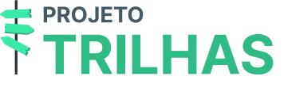

<h1 align="center">
    
</h1>

<h3 align="center">
  Não sabe qual caminho de estudos trilhar? O Projeto Trilhas vai te ajudar!
</h3>

  

  

  <a href="#calendar-sobre">Sobre</a>&nbsp;&nbsp;&nbsp;|&nbsp;&nbsp;&nbsp; 
  <a href="#memo-licença">Licença</a>&nbsp;&nbsp;&nbsp;|&nbsp;&nbsp;&nbsp; 

## :calendar: Sobre

Esse projeto foi desenvolvido pelos alunos do 3 AII do curso técnico em Informática para a Internet do [Instituto Federal de Educação, Ciência e Tecnologia  Baiano](https://ifbaiano.edu.br) para o Projeto de Conclusão de Curso

## :computer: Como executar o projeto

## :memo: Licença

Esse projeto está sob a licença MIT. Veja o arquivo [LICENSE](/LICENSE) para mais detalhes.

Please, if you are going to create another project with the same images and artwork, give credit to the authors:  
<a href="https://storyset.com/business">SVG illustrations by Storyset</a> 
<a href="https://www.blobmaker.app/">Blobs SVG made by Blobmaker</a>

Feito com :heart: por  Edmarcos, Emanuel e Giulian 
